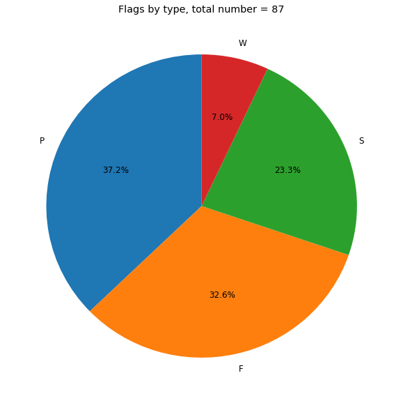

# Automated superfamily renaming
## What and why?
This repo exists to automate the renaming of current superfamilies in CATH according to [InterPro guidelines](./InterPro_guidelines.md).
***

### Automation

Most of the job is done by the custom python module [CATH-parser](CATH_parser.py).

#### [Renamed superfamilies](./results/renamed_superfamilies.tsv)
Has the easiest cases, which refer to the first part of the guidelines. Fixes errors such as trailing stops, semicolons, lowercase start (except mRNA and such) etc. Whenever a fix happens a one-letter comment is added.
* **R** - removed excessive capital letters
* **S** - replace semicolon
* **L** - lowercase start
* **T** - trailing stop
* **C** - other stop(except between digits)
* **I** - ii to II conversion, for example photosystem II
* **O** - capitalising first letter in various bacteria *(only coccus so far)*

 ***
#### [Flagged superamilies]('./results/flagged,tsv') (*work in progress*)
Superfamilies that have something wrong with the name but are too complicated to fix automatically.
* **U** - underscore
* **P** - plus
* **F** - forbidden words
* **S** - bad start
* **W** - unprreferred words

***
#### [Duplicated superfamilies](./results/duplicates.tsv)
Has a list of superfamilies with identical names. Mostly it is pairs however, there are a lot of superfamilies *named helix hairpin bin* and *single helix bin*.
